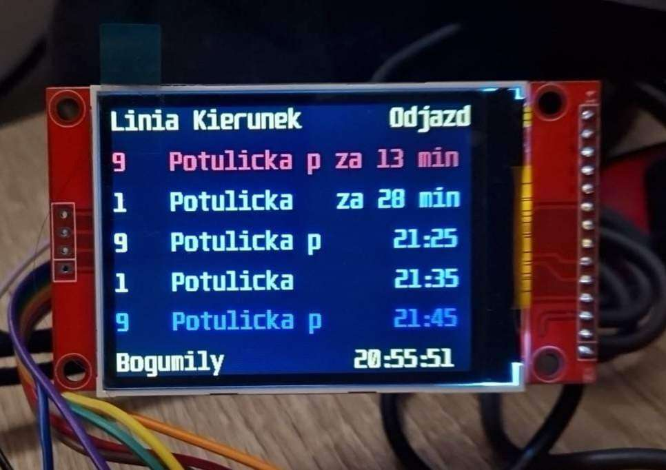

# Web Scrapped Bus Timetable

The device displays current timetable of the chosen bus (tram) stop. It shows the departure times of public transport vehicles.

## Motivation 
Every time you want to check a departure time of your bus/tram you need to open your phone app, then search for the specific line and then pick a direction. Most of the times however when I'm at home, I need to know information about departures from only or two stops (and boy, somtimes I need it fast). Back in the days we used to print the timetable, put it on the fridge and check every time before going out. However simple it was, we had to believe, that the beloved vehicle would arrive on time.

## Function
What I propose here is a dynamic arrival board of every bus/tram you need, just like the ones installed on the stops. It shows the actual arrival time of the vehicle, including delays. It's best qualities are the **speed of use** - you get the information just by looking at it, and **reliability** - below the information about departures it displays the last data aquisition date (accurate to the second), so when something goes wrong with your internet connection or ZDiTM servers, you know when you're not getting current data. 

To change between chosen stops you just press one of two buttons (one is for choosing the next stop and one for choosing the previous).

# Components
## Hardware
- Raspberry Pi Pico W
- 2,4" TFT Screen with ILI9341 chip
- two buttons (used for changing the current stop using interrups)
## Programming language
Micropython

# Usage
Needed files:
- libraries/
- rozkladjazdy.py **(change the name to main.py to run on startup)**
- config.json file

Import above files to your Raspberry. Connect the display and buttons as listed in mySetup.py file. 

## Config file
config.json file consists of:
- SSIDs and passwords to avaliable Wi-Fi
- URL addresses of the actual timetable board from ZDiTM Szczecin page

Example config file can be found [here](https://github.com/JakubNowek/Web-scrapped-BusTimetable/tree/master/PiPicoW/example_json).

## Effect
   

    <em> Wroking display showing departures from Bogumiły tram stop</em>

 
